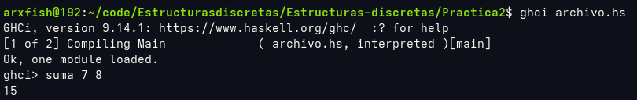

# Praćtica 2
## Objetivo de la práctica

Familiarizarse cn el entorno de ghci y con la creación y ejecución de funciones básicas y archivos en Haskell. Además de aplicar operaciones aritméticas, operadores booleanos, tuplas y diferentes tipos de datos para resolver problemas.

## Captura de pantalla 1.

## Tiempo requerido

5 horas (más que nada para investigar dudas)

## Comentarios extras

No considero que tenga algún cometario relevante.

